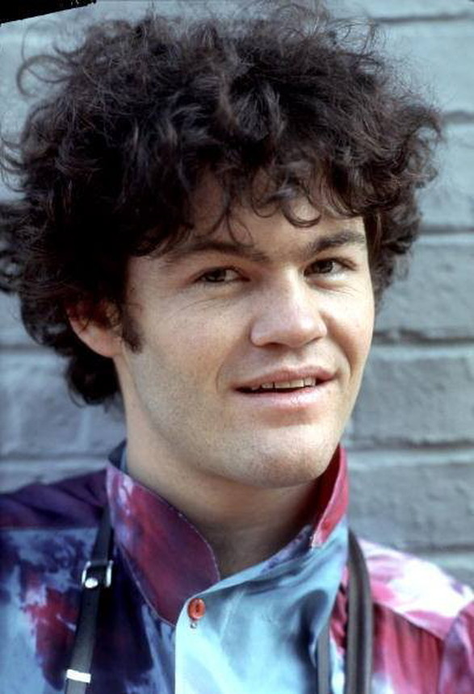

     ,-----.,--.                  ,--. ,---.   ,--.,------.  ,------.
    '  .--./|  | ,---. ,--.,--. ,-|  || o   \  |  ||  .-.  \ |  .---'
    |  |    |  || .-. ||  ||  |' .-. |`..'  |  |  ||  |  \  :|  `--, 
    '  '--'\|  |' '-' ''  ''  '\ `-' | .'  /   |  ||  '--'  /|  `---.
     `-----'`--' `---'  `----'  `---'  `--'    `--'`-------' `------'
    ----------------------------------------------------------------- 

Hi there! Welcome to Cloud9 IDE!

To get you started, create some files, play with the terminal,
or visit http://docs.c9.io for our documentation.
If you want, you can also go watch some training videos at
http://www.youtube.com/user/c9ide.

Happy coding!
The Cloud9 IDE team

<section class="container-fluid">
        

            

              

                  

                      <h3 class="text-center history-heading uppercase">
                         </h3>
                  

              

              

                  

                      <h4>The Monkees are born!</h4>
                      
Playing small pubs and clubs across California

                  

                  

                      <h4>Debut album released!</h4>
                      
Our self-titled debut hits number one on the Billboard 200!

                  

                  

                      <h4>New-found Fame</h4>
                      
The Monkees find success with a new fanbase two generations with a string of sucessful solo tours.

                  

                  

                      <h4>Latest offering!</h4>
                      
The Monkees record their first abum in almost two decades following the passing of singer Davy Jones.

                  
      
                  

                      <h4>Current Tour</h4>
                      
Over 50 years on, The Monkees are playing sold-out venues across Europe.

              

            
  
        
 
    </section>    
    
    
    
    

                

                    

                        <h3 class="section-heading uppercase"> About Me</h3>
                    

                

                

                    

                        

                            

                                <i class="three-reasons-icon fa fa-question" aria-hidden="true"></i>
                            

                            

                                <h4 class="three-reasons-heading uppercase">What do I do?</h4>
                                

                                    I'm a skilled Full Stack Developer with a wealth of diverse 
                                    life and technical experience that I bring to every project.
                                

                            

                        

                    

                    

                        

                            

                                <i class="three-reasons-icon fa fa-thumbs-up" aria-hidden="true"></i>
                            

                            

                                <h4 class="three-reasons-heading uppercase">How do I do it?</h4>
                                

                                    I follow form as well as function. 
                                    I know that the aesthetics of effective designcombined with application speed,
                                    security and reliability combine to create a great user experience.
                                

                            

                        

                    

                    

                        

                            

                                <i class="three-reasons-icon fa fa-bolt" aria-hidden="true"></i>
                            

                            

                                <h4 class="three-reasons-heading uppercase">Why hire me?</h4>
                                

                                    I work quickly and effectively in getting things built and working across the stack.
                                    I'm an exellent communicator who thrives in bright and enthusiastic teams 
                                    and I'm also a self-starter when working solo.
                                

                            

                        

                    

                

            

        

          

      </section>
      
      
      
      
      
      <section class="container-fluid">
        

                

                    

                        <h3 class="section-heading uppercase"> Meet the Band!</h3>
                    

                

                

                    

                        

                            

                                <i class="three-reasons-icon fa fa-question" aria-hidden="true"></i>
                            

                            

                                <h4 class="three-reasons-heading uppercase">What do I do?</h4>
                                
                            

                        

                    

                    
                    

                        

                            

                                <i class="three-reasons-icon fa fa-question" aria-hidden="true"></i>
                            

                            

                                <h4 class="three-reasons-heading uppercase">What do I do?</h4>
                                
                            

                        

                    

                    
                    

                        

                            

                                <i class="three-reasons-icon fa fa-question" aria-hidden="true"></i>
                            

                            

                                <h4 class="three-reasons-heading uppercase">What do I do?</h4>
                                
                            

                        

                    

                    
                    

                        

                            

                                <i class="three-reasons-icon fa fa-question" aria-hidden="true"></i>
                            

                            

                                <h4 class="three-reasons-heading uppercase">What do I do?</h4>
                                
                            

                        

                    
